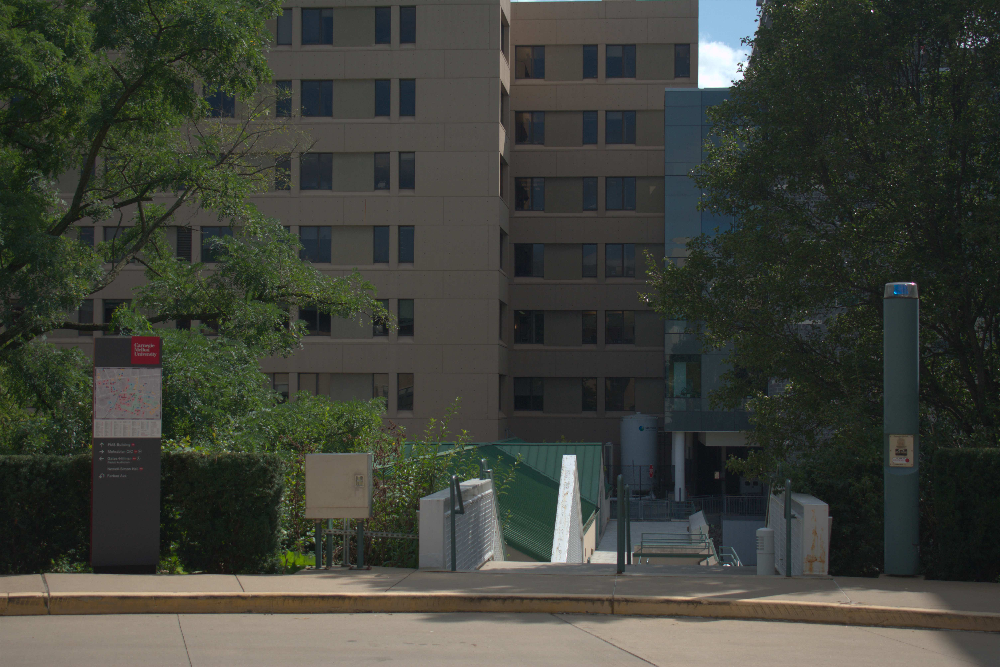

# Assignment 1
## 1 Developing RAW images

### 1.1 Implement a basic image processing pipeline (80 points)


#### RAW image conversion (5 points).


1. Copy codes from https://www.dechifro.org/dcraw/dcraw.c to `hw/assgn1/utils/dcraw.c`
2. Compile with `gcc -o dcraw -O4 dcraw.c -lm -ljasper -ljpeg -llcms2` OR `gcc -o dcraw -O4 dcraw.c -lm -DNODEPS`. [The second option works for me.]
3. Run `./hw/assgn1/utils/dcraw -4 -d -v -w -T hw/assgn1/data/campus.nef`
I got following messages:
```
Loading Nikon D3400 image from hw/assgn1/data/campus.nef ...
Scaling with darkness 150, saturation 4095, and
multipliers 2.394531 1.000000 1.597656 1.000000
Building histograms...
Writing data to hw/assgn1/data/campus.tiff ...
```
Recording these parameters:
```
<black> = 150
<white> = 4095
<r_scale> = 2.394531
<g_scale> = 1.000000
<b_scale> = 1.597656
<g_scale> = 1.000000
```
4. Delte the file `hw/assgn1/data/campus.tiff` and run `./hw/assgn1/utils/dcraw -4 -D -T hw/assgn1/data/campus.nef`

#### Python initials (5 points).
According to the command output, `per_bits=16` and `height, width = 4016, 6016.`


#### Linearization (5 points).
`raw_linear = (raw - black) / (white - black)`


#### Identifying the correct Bayer pattern (20 points).
Solution:
After the white balancing, rearrange all channels in RGB order. And then save 4 patterns png file. I found the `rggb` seems to be the correct pattern.
|||
|:--:|:--:|
|*rggb*|*gbrg*|

|||
|:--:|:--:|
|*grbg*|*bggr*|


#### White balancing (10 points).
|  | ||
|:--:| :--:|:--:|
| *Gray world Assumption* |*White world Assumption*|*Preset WB parameters*|


I think the preset parameters work well.


#### Demosaicing (10 points).
Method:
1. Apply white balance parameters to raw image.
2. Split all 3 channels.
3. Interpolate the missing values by bilinear interpolation.
4. Concatenate the R/G/B channels.

||
|:--:|
|*rgb_dmsc*|

#### Color space correction (10 points).
Methods:
1. Accroding to the information above. Dcraw shows that the image was captured by Nikon D3400, so I searched the Nikon D3400 `Mxyz->cam` in `hw/assgn1/utils/dcraw.c`
2. Calculate the matrix `MsRGB->cam`.
3. Normalize the `MsRGB->cam`.
4. Apply the matrix to RGB image.

||
|:--:|
|*srgb*|


   
#### Brightness adjustment and gamma encoding (10 points).
Brightness adjustment methods:
1. Convert RGB to gray.
2. Apply mutiple scalers to gray image.

||||
|:--:|:--:|:--:|
|*gray_1.0*|*gray_2.0*|*gray_3.0*|


Gamma encoding:
||
|:--:|
|*srgb_gamma*|

#### Compression (5 points).
Methods:
Apply mutiple quality options to save jpeg file.
||||
|:--:|:--:|:--:|
|*quality95*|*quality75*|*quality55*|

The jpeg that the quality=75 seems better.


### 1.2 Perform manual white balancing (10 points)
Method:
1. Crop patch that should be white.
2. Each position contains 3 channel values. (RGB)
3. Take G to be the target value, solve the equaltion: wR = R'
4. Since R and R' are vectors, use Least Squares minimize the error. The same calculation for B channel.
5. Apply white balance parameters to rgb image.


|||
|:--:|:--:|
|*rgb_woWB*|*rgb_w/WB*|


### 1.3 Learn to use dcraw (10 points)
Run command:
`./hw/assgn1/utils/dcraw -e hw/assgn1/data/campus.nef`

`-e`: Extract  the  camera-generated  thumbnail,  not the raw image.  You'll get either a JPEG or a PPM file, depending on the camera.

File generated path: `hw/assgn1/data/campus.thumb.jpg`
||||
|:--:|:--:|:--:|
|*Python Pipeline*|*Camera Pipeline*|*DcRaw Pipeline*|